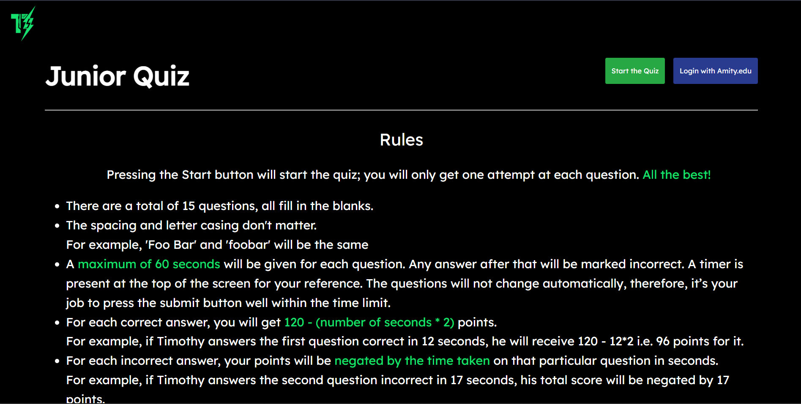
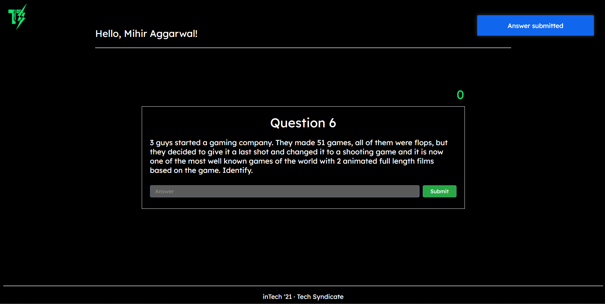

# quiz-platform

Platform for [Tech Syndicate](https://github.com/techsyndicate)'s annual intra-school event, inTech 2021's quiz prelims.

## Why?

With inTech being hosted online due to the Coronavirus, malpractices were bound to occur in most events. The quiz, being especially susceptible to cheating by simply a google search, needed a different approach. We came up with one involving a timer-based points system and a tab-change detection; to facilitate this, we developed this platform.

## Rules

- A maximum of 60 seconds are given for each question. Any answer after that is automatically marked incorrect.
- For each correct answer, the user will get `120 - (number of seconds * 2)` points.
  For example, if Timothy answers the first question correct in 12 seconds, he will receive `120 - (12 * 2)` i.e. 96 points for it.
- For each incorrect answer, the user's points will get negated by the time taken on that particular question.
  For example, if Timothy answers the second question incorrect in 17 seconds, his total score will be negated by 17 points.
  So after two questions, Timothy's final score would be 96-17 i.e. 79 points.
- Switching tabs / windows, reloading, minimising, or changing the URL is not permitted. Doing so automatically marks that question as incorrect.

---





## Usage

- Clone the repository using the command
  
  ```
  git clone https://github.com/mihiraggarwal/quiz-platform.git
  ```

- Install all the dependencies
  
  ```
  cd && npm i
  ```

- Fill all the environment variables in `.env.example` and rename it to `.env`
- Run the server using the command
  
  ```
  npm start
  ```
